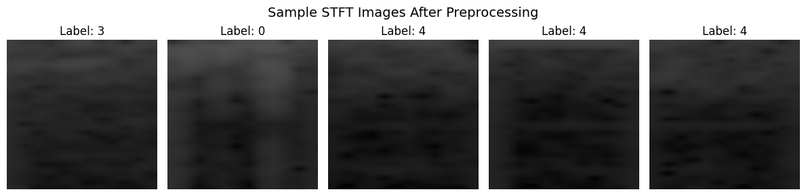
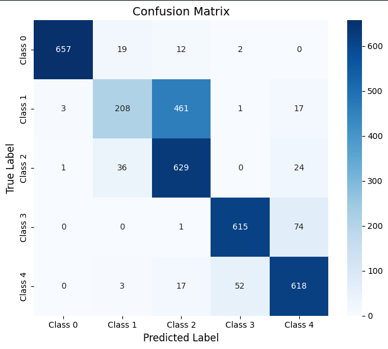
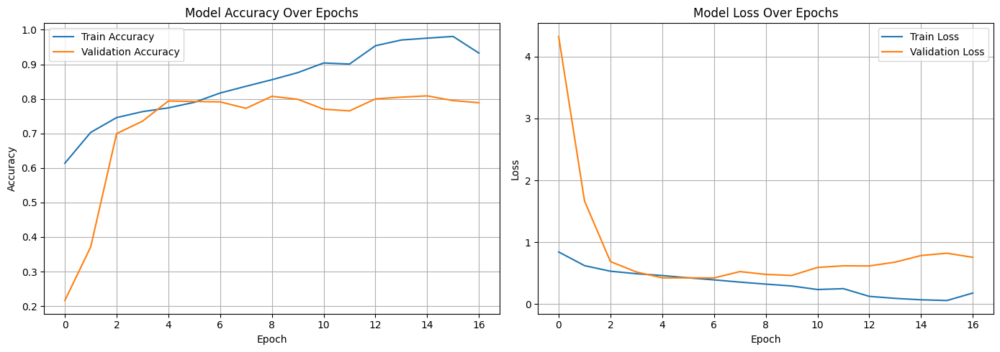

# EEG Seizure Detection using Deep Learning



## Overview

This project presents a deep learning-based approach for EEG (Electroencephalography) signal classification and epileptic seizure pattern recognition.

The proposed pipeline converts raw EEG signals into time-frequency spectrogram representations using Short-Time Fourier Transform (STFT), then utilizes an EfficientNetB0-based convolutional neural network for multi-class classification.

This project explores the application of deep learning techniques in biomedical signal processing and healthcare AI.

---

## Problem Statement

EEG signals contain complex temporal patterns that can be challenging to analyze manually.

Automated deep learning approaches can help extract meaningful patterns from EEG data by learning representations directly from transformed signal data.

This project investigates the use of signal processing and deep learning methods for automated EEG classification.

---

## Methodology

The complete workflow consists of the following stages:

```
Raw EEG Signal
       ↓
Signal Preprocessing
       ↓
STFT Transformation
       ↓
Spectrogram Generation
       ↓
EfficientNetB0 Feature Extraction
       ↓
Multi-Class Classification
```

### Signal Processing

- Raw EEG signals are transformed into time-frequency representations using Short-Time Fourier Transform (STFT).
- Generated spectrograms are resized and converted into image-like inputs.
- The processed representations are used as input for the deep learning model.

### Deep Learning Model

The classification architecture is based on EfficientNetB0:

- EfficientNetB0 convolutional feature extractor
- Global Average Pooling layer
- Fully connected classification layers
- Softmax output layer for multi-class prediction

---

## Dataset

**Dataset:** Epileptic Seizure Recognition Dataset

The dataset contains EEG signal samples categorized into five different classes.

The raw EEG signals are transformed into spectrogram representations before training the classification model.

---

## Model Architecture

```
EEG Signal
    ↓
STFT Spectrogram
    ↓
EfficientNetB0
    ↓
Global Average Pooling
    ↓
Dense Layer
    ↓
Softmax Classification
```

---

## Technologies

- Python
- TensorFlow / Keras
- EfficientNetB0
- Librosa
- OpenCV
- Scikit-learn
- NumPy
- Pandas

---

## Results

The model was evaluated on the test set using multiple classification metrics.

### Performance Summary

- **Test Accuracy:** 79.04%
- **Macro Precision:** 81.97%
- **Macro Recall:** 79.04%
- **Macro F1-score:** 77.52%

### Classification Metrics

| Class | Precision | Recall | F1-score |
|------|-----------|--------|----------|
| Class 0 | 0.9939 | 0.9522 | 0.9726 |
| Class 1 | 0.7820 | 0.3014 | 0.4351 |
| Class 2 | 0.5616 | 0.9116 | 0.6950 |
| Class 3 | 0.9179 | 0.8913 | 0.9044 |
| Class 4 | 0.8431 | 0.8957 | 0.8686 |

### Confusion Matrix



### Training Performance



---

## Project Structure

```
EEG-Seizure-Detection-AI/

├── EEG_Seizure_Detection.ipynb
├── README.md
├── requirements.txt
├── LICENSE
│
└── results/
    ├── stft_samples.png
    ├── confusion_matrix.png
    └── learning_curves.png
```

---

## Key Highlights

- EEG signal processing using STFT transformation
- Spectrogram-based deep learning classification
- EfficientNetB0 implementation for biomedical signal analysis
- Multi-class EEG pattern recognition
- Model evaluation using multiple classification metrics
- Visualization of signal representations and model performance

---

## Future Improvements

Possible improvements include:

- Applying transfer learning with pretrained EfficientNet weights
- Exploring alternative deep learning architectures
- Increasing dataset diversity
- Applying advanced data augmentation techniques
- Developing real-time EEG monitoring applications

---

## Project Context

This project was developed as part of university coursework to explore deep learning applications in biomedical signal processing and healthcare AI.

---

## Authors

**Mhd Adnan Lahham**  
**Ahmad Altabaa**
